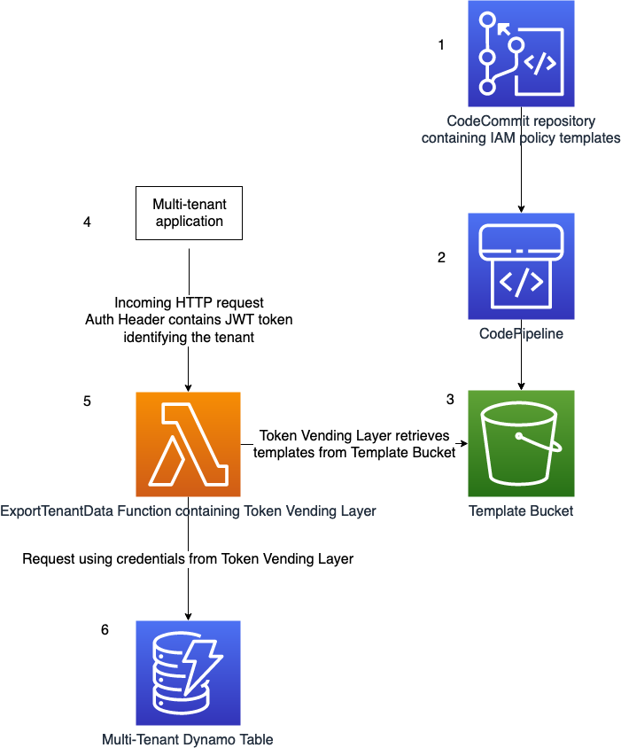

# Govern access to tenants’ data in your SaaS application using AWS IAM

This repository contains a small application that implements the principles discussed in the blogpost [Govern access to tenants’ data in your SaaS application using AWS IAM]().

What's the problem this work aims to solve? 
Ideally IAM roles should be scoped to the smallest set of resource and actions permissions required. 
In a multi-tenant application, the combination of multiple tenants and services can result in a high number of roles to manage.

## Overview

This project contains source code and supporting files to deploy the application. It implements two lambda functions and a DynamoDB table.




1. A CodeCommit repository contains IAM Policy templates. Changes to the templates can be tracked using version control.

2. The creation of a git tag with the prefix `release` invokes a CodePipeline execution, that zips the templates and uploads the file to S3.

3. The Template Bucket contains the uploaded template files. Each object is of the form `templates/$GIT_HASH/policies.zip`

4. A multitenant application makes a request to the [ExportTenantData Function](#ExportTenantData-Function), containing the Authorization Header. The header is of the form `Authorization: Bearer $JWT`. `$JWT` represents a JSON Web Token (JWT). The JWT contains a custom claim, `custom:tenant_id`. This custom claim is used by the [Token Vending Layer](#Token-Vending-Layer) to scope credentials to just the responsible tenant.

5. The [Token Vending Layer](#Token Vending Layer) retrieves the templates from the S3 Bucket. TODO explain further

6. The credentials from the [Token Vending Layer](#Token Vending Layer) are used to access the [multi-tenant DynamoDB table](#multi-tenant-dynamodb-table). These credentials are scoped to the tenant, and don't have permission to access other tenants data.

### ExportTenantData Function
The `ExportTenantData` function demonstrates a small microservice used by tenants of an application. 
The ExportTenantData function can store and retrieve data from a multi-tenant DynamoDB table.

The `ExportTenantData` function uses the [Lambda Layer](https://docs.aws.amazon.com/lambda/latest/dg/configuration-layers.html) `TokenVendingLayer` to assume a role with credentials scoped to the tenant making the request.


### Template Pipeline

An AWS CodeCommit repository contains templated IAM Policies. 
Upon the creation of a tag with prefix `release`, for example `release-1.0`, Amazon CodePipeline creates a zip file of the templates and stores it as an object in S3. The Token Vending Layer retrieves the zipped templates file from S3.
An AWS CodePipeline executes on change to the repository.


### Token Vending Layer

This sample uses the [Dynamic Policy Generation](https://github.com/aws-samples/aws-saas-factory-dynamic-policy-generation) library. Read about [Dynamic Policy Generation and the supporting library on the AWS blog](https://aws.amazon.com/blogs/apn/isolating-saas-tenants-with-dynamically-generated-iam-policies/)


> ⚠️ Warning \
> This sample uses a hardcoded secret for verifying the JSON web token signature. \
> This shouldn't copied in an application.\
> Instead, the application should retrieve the secret from [AWS Systems Manager Parameter Store](https://docs.aws.amazon.com/systems-manager/latest/userguide/systems-manager-parameter-store.html) or  [AWS Secrets Manager](https://docs.aws.amazon.com/secretsmanager/latest/userguide/intro.html).

### Multi-Tenant DynamoDB Table


### AssumeRoleWatchDog

The `AssumeRoleWatchDog` resource is a lambda function. 
The purpose of the AssumeRoleWatchDog is safeguard against the assumption of a role without an inline policy included. 
This is important in a multi-tenant environment
It inspects `AssumeRole` events of the account. If a role in the account is assumed without an inline policy, the watchdog sends a notification to the `WatchdogSnsTopic` defined in the template.

## Deploy the sample application

The application uses several AWS resources, including Lambda functions and an API Gateway API. The `Resources` section of the file `template.yaml` defines the resources in this project.

1. Prerequisites

    - AWS CLI - [Install the AWS CLI](https://docs.aws.amazon.com/cli/latest/userguide/cli-chap-install.html) and [configure it with your AWS credentials].
    - Java8 - [Install the Java SE Development Kit 8](http://www.oracle.com/technetwork/java/javase/downloads/jdk8-downloads-2133151.html)

2.  Clone the repository

    ```bash
    git clone git+https://github.com/aws-samples/saas-tenant-isolation-architecture
    ```

3. 
    To build and deploy your application for the first time, run the following in your shell:

    ```bash
    export STACK_NAME=<Define the stack name>

    # The packaged template is uploaded to an S3 bucket.
    export DEPLOYMENT_S3_BUCKET="$STACK_NAME"-packaging-bucket

    # The S3 Bucket containing the zipped policy templates to bootstrap the CodeCommit repository
    export TEMPLATE_BUCKET_NAME=<template s3 bucket>
    export TEMPLATE_OBJECT_KEY=<template zip file>

    # Create the bucket if it doesn't exist
    # aws s3 mb s3://$DEPLOYMENT_S3_BUCKET

    # Build the source
    make build

    # Deploy
    make deploy
    ```

    The first command will build the source of your application.
    The second command will package the application and deploy your application to AWS.

    You can find the API Gateway Endpoint URL in the output values displayed after deployment.

### Testing the Application

Test that the deployment was successful by posting and retrieving data from the `/tenant` endpoint.


Post data to the endpoint
Set the `URL` variable to the API Gateways Endpoint Output from the CloudFormations stack
Set the `AUTH` to a valid JWT token. 
```bash
URL=<ENDPOINT URL>
AUTH=<JWT TOKEN>

curl \
    --request POST \
    --header "Content-Type: application/json" \
    --header "Authorization: Bearer $AUTH" \
    --data '{"data":"test-data"}' \
    $URL 
```

Get data from the endpoint
```bash
curl \
    --header "Authorization: Bearer $AUTH" \
    $URL
```


## Cleanup

To delete the deployed sample application, follow the steps below.

1. Delete contents of S3 buckets included in the application.
    - PipelineArtefactBucket
    - TemplateOutputBucket
2. Delete CloudFormation stack. 
    - To delete the stack with the aws cli, use the following command.

```bash
aws cloudformation delete-stack --stack-name <STACK NAME>
```

## License

This sample is licensed under the MIT-0 license.
